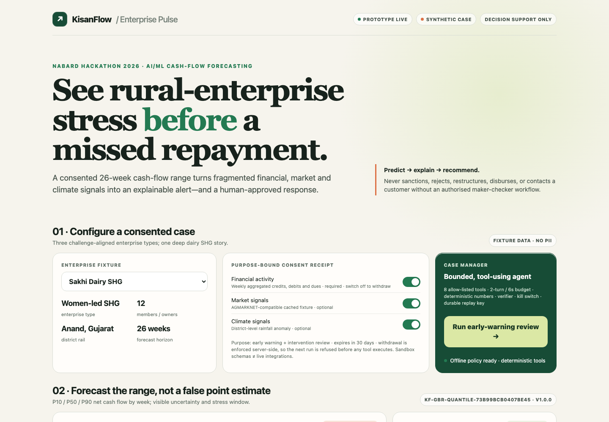

# KisanFlow Enterprise Pulse

[](https://github.com/gowtham66867/KisanFlow/actions/workflows/ci.yml)
[](https://kisanflow-demo-1012823692058.us-east1.run.app)
[](LICENSE)

**Predict the next 26 weeks. Explain emerging stress. Recommend a consented response. Stop at an authorised human.**

KisanFlow is a working NABARD Hackathon 2026 prototype for SHGs, FPOs and rural micro-enterprises. It combines weekly financial activity, optional digital-payment proxies, market intelligence and climate seasonality into P10/P50/P90 cash-flow forecasts, an early-warning card and a maker-checker intervention workflow.

**Live product demo:** [kisanflow-demo-1012823692058.us-east1.run.app](https://kisanflow-demo-1012823692058.us-east1.run.app)

**Three-minute demo video:** [Watch the KisanFlow product walkthrough on Loom](https://www.loom.com/share/b22f095e05fd43a1b061f9d87f1eac70)

[](https://kisanflow-demo-1012823692058.us-east1.run.app)

> Evidence labels are deliberate: **LIVE** means running code; **SYNTHETIC** means generated fictional cases/evaluation data; **SANDBOX** means a validated adapter contract or fixture, not a production connection. The prototype is decision support and never sanctions, rejects, restructures, disburses, or contacts a customer on its own.

## Start here

- **See the complete story:** watch the [three-minute demo video](https://www.loom.com/share/b22f095e05fd43a1b061f9d87f1eac70), open the [live demo](https://kisanflow-demo-1012823692058.us-east1.run.app), and download the [ten-slide presentation](KisanFlow_Presentation.pptx).
- **Reproduce the proof:** follow the [presenter walkthrough](DEMO_WALKTHROUGH.md), run the [automated tests](#run-locally), then inspect the machine-readable [model metrics](artifacts/model_metrics.json) and [agent-harness evaluations](docs/evals/AGENT_HARNESS_EVALS.md).
- **Developer:** follow [Run locally](#run-locally), then inspect the [technical architecture](docs/TECHNICAL_ARCHITECTURE.md) and [OpenAPI contract](api/openapi.yaml).
- **Field or product team:** use the [operator and user guide](docs/USER_GUIDE.md) for the case workflow, result interpretation and refusal paths.
- **Model-risk or governance reviewer:** start with the [model card](MODEL_CARD.md), [data card](DATA_CARD.md), [threat model](THREAT_MODEL.md) and [responsible-AI controls](docs/governance/RESPONSIBLE_AI.md).

## Utility: what KisanFlow changes

Rural-finance teams often see fragmented ledger, payment, market and climate signals only after liquidity stress becomes repayment trouble. KisanFlow turns those signals into a forward-looking operating workflow:

1. Forecast a **26-week cash-flow range**, not a single opaque score.
2. Surface the likely **stress window, recovery pattern and reason codes**.
3. Compare a small set of institution-approved responses as **what-if scenarios**, never causal promises.
4. Produce an evidence-backed action card for an authorised maker.
5. Stop at an **independent checker** before any customer or account action.

The immediate users are NABARD partner institutions, field officers, SHG/FPO support teams and model-risk reviewers. The intended benefit is earlier, better-grounded human review—not automated credit decisioning.

## Why this fits the challenge

The [official NABARD Hackathon 2026 brief](https://www.globalfintechfest.com/gff-hackathons/nabard-hackathon) asks for an AI/ML system that forecasts rural-enterprise cash flow over three to six months, integrates multiple financial/transaction/market/climate sources, flags stress early and provides actionable insights. KisanFlow implements that exact arc with a 26-week horizon and three challenge-aligned enterprise fixtures.

The anchor scenario is a women-led dairy SHG. Two additional fixtures demonstrate transfer to a millet micro-enterprise and an FPO while keeping the human outcome clear.

## What actually runs

1. **Measured forecast pipeline** — `ml/train_model.py` generates 90 fictional enterprises over 104 weeks, trains Gradient Boosting quantile models, benchmarks them against a seasonal-naïve baseline using three rolling origins and emits a versioned artifact.
2. **Early-warning evaluation** — the artifact reports precision, recall, false alerts per 100, median lead weeks and cohort gaps at a conservative operating point, plus a lower-threshold watchlist.
3. **Bounded Case Manager** — eight typed tools validate consent, retrieve a fixture, compute lag-only features, return P10/P50/P90, detect stress, ground an intervention, simulate it and create a proposed action card.
4. **Real agent adapter, honest fallback** — when `GEMINI_API_KEY` is configured, an LLM plans the allow-listed tool route; otherwise the same container visibly uses an `offline_policy_runner`. Deterministic tools own every number in both modes.
5. **Verifier + human gate** — the verifier *executes* five checks (run completeness, quantile ordering and length, source provenance, consent validity and the no-autonomous-action boundary) and returns 409 with the failing check names when any fails. Output stops at `awaiting_independent_checker`; same-actor approval is impossible in the public demo.
6. **Inspectable evidence** — consent status, source freshness, reason codes, budgets, idempotency, replay fingerprint, model ID, trace and known limitations are visible in the UI.

## Advanced agentic AI—implemented, not merely named

KisanFlow uses a bounded agent harness rather than an unconstrained chatbot:

| Concept | Implementation | Why it matters |
|---|---|---|
| Constrained planning | Gemini may select and order only eight named tools; its JSON plan is filtered against the allow-list | A model cannot invent sanction, contact or account-change capabilities |
| Deterministic tool ownership | Forecasts, stress logic, simulations and IDs come from versioned code/artifacts | LLM prose cannot alter financial numbers |
| Contract-first state | Typed request, consent and action-card schemas plus a shared run state | Every handoff is inspectable and testable |
| Executed verifier | Five checks recompute completeness, quantile ordering, provenance, consent and autonomy boundaries | A bad run returns 409 instead of presenting an unsupported answer |
| Human-in-the-loop control | Maker creates a proposal; a separate checker is required | Separation of duties is enforced as product state |
| Bounded autonomy | Eight-tool, two-turn and six-second budgets with a 4.5-second planner timeout | Loops and latency are capped |
| Graceful degradation | Missing key, timeout or model error selects the labelled deterministic policy runner | The demo remains functional without pretending the fallback is LLM-controlled |
| Durable semantics | Idempotency key, stable action-card ID and replay fingerprint | Retries remain traceable and do not create duplicate proposals |
| Operational control | Consent withdrawal, request limits, security headers, one-instance cap and kill switch | Privacy, misuse and cost risks have explicit stop mechanisms |

See [Technical architecture and agent harness](docs/TECHNICAL_ARCHITECTURE.md) for the sequence, trust boundaries, tool contracts and failure behaviour.

Current synthetic evaluation (regenerate; do not hand-edit):

| Measure | Result | Interpretation |
|---|---:|---|
| MASE | 0.52 | Beats the seasonal-naïve baseline on synthetic holdouts |
| MAE improvement | 48.0% | Relative to seasonal-naïve MAE |
| P10–P90 coverage | 83.2% | Close to the nominal 80% band |
| Conservative EWS precision | 45.8% | Alerts that precede labelled synthetic stress |
| Conservative EWS recall | 28.2% | Deliberate precision/workload trade-off |
| False alerts / 100 | 0.83 | Conservative operating point |
| Median warning lead | 2.0 weeks | Median time from alert to labelled synthetic stress |
| Maximum cohort recall gap | 0.092 | Synthetic diagnostic only—not real-world fairness evidence |

## Safety behaviour you can reproduce against the live service

Each refusal below is enforced server-side and covered by a test. The controls can be reproduced directly against the live service:

| Attempt | Response |
|---|---|
| Withdrawn consent (`revoked: true`) or `financial: false` | `422 contract_rejected` before a single tool executes |
| Expired or unparseable consent receipt | `422 contract_rejected` |
| Prohibited personal field (`aadhaar`, `phone`, `account_number`, …) | `422 prohibited field` |
| Injected instruction supplied as a `prompt` field | `422 prohibited field: prompt` |
| Checker acting as maker, or an unknown fixture | `422 contract_rejected` |
| Body above 32 KiB / wrong method / malformed JSON / path traversal | `413` / `405` / `400` / `404` |
| `KISANFLOW_KILL_SWITCH=on` | `503 kill_switch_engaged`, and `/api/status` reports `halted` |
| Same fixture replayed | Identical replay fingerprint, idempotency key and action-card id |

The forecast, stress window and simulation always come from the versioned artifact; the optional LLM planner may only choose among the eight allow-listed tools.

## Run locally

```bash
python3 -m venv .venv
source .venv/bin/activate
python3 -m pip install -r requirements.txt
npm install
python3 ml/train_model.py
npm test
npm run build:application
npm run serve
```

Open `http://localhost:8080`. You can also open `demo/kisanflow_demo.html` directly; open-file mode uses the same artifact and a browser-local policy runner.

### Run a case through the API

```bash
curl -sS -X POST http://localhost:8080/api/agent/run \
  -H 'Content-Type: application/json' \
  -d '{
    "scenario":"dairy_shg",
    "intervention":"timing",
    "consent":{"financial":true,"market":true,"climate":true,"revoked":false},
    "actor":{"id":"demo-maker","role":"maker"}
  }'
```

The expected result has `verifier.passed=true`, eight completed tool events, an `awaiting_independent_checker` action card, and both `customer_contacted` and `account_changed` set to `false`. Complete UI, API, interpretation and troubleshooting instructions are in the [user guide](docs/USER_GUIDE.md).

### Enable model-planned tool selection

The public demo intentionally needs no paid model call. To exercise the optional Gemini planner, set `GEMINI_API_KEY` and optionally `GEMINI_MODEL` before starting the server. The model selects tools only; deterministic services and the verifier remain authoritative.

```bash
export GEMINI_API_KEY='your-secret-from-a-secure-secret-store'
export GEMINI_MODEL='gemini-2.5-flash-lite'
npm run serve
curl -sS http://localhost:8080/api/status
```

Never commit a model key. On Cloud Run, bind it from Secret Manager as described in [deployment guidance](cloud-run/DEPLOYMENT.md).

## Repository map

- `demo/kisanflow_demo.html` — responsive, zero-dependency product experience.
- `ml/train_model.py` + `artifacts/model_metrics.json` — reproducible forecast/EWS benchmark and canonical metrics.
- `cloud-run/server.js` — static server plus bounded `/api/agent/run` harness.
- `api/openapi.yaml` + `api/schema/` — interoperable API and consent/action contracts.
- `MODEL_CARD.md`, `DATA_CARD.md`, `THREAT_MODEL.md` — model/data limits and security boundaries.
- `docs/evals/` + `docs/governance/` — release-blocking agent tests and responsible-AI/DPDP readiness.
- `docs/TECHNICAL_ARCHITECTURE.md` — system architecture, planner/tool/verifier lifecycle and failure controls.
- `docs/USER_GUIDE.md` — product, operator and developer usage with response interpretation.
- [`KisanFlow_NABARD_Application.docx`](KisanFlow_NABARD_Application.docx) — evidence-backed application.
- [`KisanFlow_Presentation.pptx`](KisanFlow_Presentation.pptx) — current ten-slide product and pilot presentation.
- `DEMO_WALKTHROUGH.md` — timed live-demo narrative and technical Q&A.
- `cloud-run/DEPLOYMENT.md` — free-tier-oriented deployment and verification.

## Data rails and governance

Account Aggregator is positioned as a consented financial-data rail, consistent with [Sahamati’s AA resources](https://sahamati.org.in/account-aggregator-key-resources/), not as a hidden data broker. LokOS/SHE-LEAPS is a potential institutional adapter because the [Government of India describes LokOS as a digital backbone for SHG/community-organisation activity](https://www.pib.gov.in/FactsheetDetails.aspx?Id=150688&lang=1&reg=3). AGMARKNET and IMD are market/climate adapters. All are marked sandbox until a production institution supplies authorisation and credentials.

The open core maps to the [Digital Public Goods Standard’s nine indicators](https://www.digitalpublicgoods.net/standard) through Apache-2.0 licensing, clear ownership, platform independence, documentation, non-PII extraction, privacy controls, open standards and do-no-harm safeguards. This is **DPG-ready evidence**, not a claim of DPGA recognition.

Consent and retention controls are designed for the [Digital Personal Data Protection Rules, 2025](https://www.meity.gov.in/documents/act-and-policies/digital-personal-data-protection-rules-2025-gDOxUjMtQWa) and applicable RBI/partner-institution policy. A pilot still requires a formal DPIA, legal review and partner sign-off.

## Pilot proposal

Six months, two districts, three cohorts and 500 enterprises:

- Weeks 0–4: agreements, schemas, consent UX, retrospective extract and operating thresholds.
- Weeks 5–10: temporal validation, cohort review, field-officer playbook and red-team tests.
- Weeks 11–18: silent-mode alerts with no customer action; measure coverage, precision/recall and workload.
- Weeks 19–26: controlled maker-checker interventions; compare lead time, consent completion, missed-payment rate and officer time.

Promotion requires approved data/privacy controls, stable calibration, acceptable cohort gaps, no release-blocking agent failure and an agreed rollback threshold.

## Honest limitations

No current claim is based on a production lender, NABARD, AA, LokOS, ULI, IMD or AGMARKNET feed. Synthetic metrics do not establish production accuracy or fairness. Counterfactual uplift is illustrative, not causal. Cloud Run settings are free-tier-oriented rather than a guarantee of zero cost. The partner regulated institution remains accountable for data processing, policy, customer communication and every credit action.
